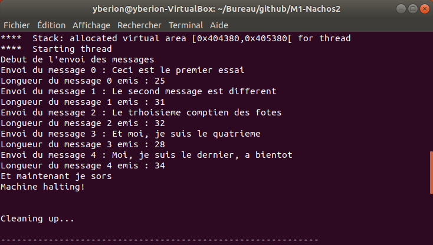
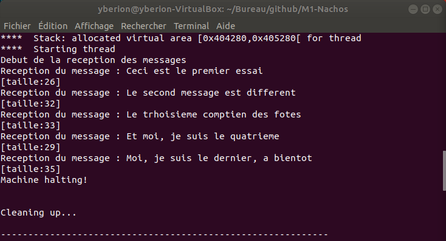

# Compte rendu - TP2 Gestion d'entrées/sorties caractères

### Brandon Largeau - Nathan Rio

https://github.com/Yberion/M1-Nachos

## Constructeur

Pour les besoins du driver, il faut initialiser les variables dans le constructeur.

Chaque membre de la classe doit être initialisé dans le constructeur.

On vérifie sur quel mode on est via ``g_cfg->ACIA`` et on met le mode ACIA en ``BUSY_WAITING`` quand on est en attente active et ``REC_INTERRUPT`` quand on est en mode interruption permettant le remplissage du buffer d'envoie.

On créé un lock pour l'envoie et la réception pour protéger l'appel à ``g_machine->acia->PutChar(buffer[i])`` et ``buffer[i] = g_machine->acia->GetChar();`` dans le cas du multithreading.

On créé un sémaphore pour l'envoie et la réception. Le sémaphore de l'envoie a un token permettant l'envoie de caractère via activation de l'interruption après remplissage du buffer.

https://github.com/Yberion/M1-Nachos/blob/master/drivers/drvACIA.cpp#L37

```C++
DriverACIA::DriverACIA()
{
    DEBUG('d', "Creating ACIA driver\n");

    switch (g_cfg->ACIA)
    {
        case ACIA_BUSY_WAITING:
        {
            g_machine->acia->SetWorkingMode(BUSY_WAITING);
            break;
        }
        case ACIA_INTERRUPT:
        {
            g_machine->acia->SetWorkingMode(REC_INTERRUPT);
            break;
        }
        default:
            DEBUG('d', "Error: wrong ACIA mode (need ACIA_BUSY_WAITING, ACIA_INTERRUPT, ...)\n");
            break;
    }

    send_buffer[BUFFER_SIZE] = { 0 };
    receive_buffer[BUFFER_SIZE] = { 0 };

    semaphore_send = new Semaphore("send_semaphore driver ACIA", 1);
    semaphore_receive = new Semaphore("receive_semaphore driver ACIA", 0);

    lock_send = new Lock("lock_send driver ACIA");
    lock_receive = new Lock("lock_receive driver ACIA");

    index_send = 0;
    index_receive = 0;
}
```

## Attente active - ``UseACIA = BusyWaiting``

### ``int DriverACIA::TtySend(char *buffer)``

On commence à ``i = -1`` car on fait un ``do while``. S'il n'y a rien dans ``outputRegister`` on entre dans la boucle. On a ici le lock dans le cas du multithreading pour verrouiller la ressource et on écrit la lettre dans ``outputRegister`` via ``PutChar()``.

``buffer[i]`` étant le buffer qui contient le texte à envoyer.

Pour les tests :

Commande ``./nachos -x io_TtySend``.

* ``NumPortLoc = 32010``
* ``NumPortDist = 32009``

https://github.com/Yberion/M1-Nachos/blob/master/drivers/drvACIA.cpp#L84

```C++
...

i = -1;

do
{
    while(g_machine->acia->GetOutputStateReg() == EMPTY)
    {
        ++i;

        lock_send->Acquire();
        g_machine->acia->PutChar(buffer[i]);
        lock_send->Release();
    }
} while (buffer[i] != '\0');

...
```



### ``int DriverACIA::TtyReceive(char *buffer, int length)``

Si ce n'est pas la fin et qu'il y a quelque chose dans ``outputRegister`` on entre dans la boucle. On a ici le lock dans le cas du multithreading pour verrouiller la ressource et on lit la lettre de ``outputRegister`` vers ``buffer[i]`` avec l'utilisation de ``GetChar()``. Cette utilisation reset ``outputRegister`` grâce à l'appel ``sysdep->Drain();`` qui est dans ``GetChar()``.

``buffer[i]`` étant le buffer qui va recevoir le texte.

Pour les tests :

Commande ``./nachos -x io_TtyReceive``.

* ``NumPortLoc = 32009``
* ``NumPortDist = 32010``

https://github.com/Yberion/M1-Nachos/blob/master/drivers/drvACIA.cpp#L153

```C++
...

 while (!fin)
{
    while (g_machine->acia->GetInputStateReg() == FULL)
    {
        lock_receive->Acquire();
        buffer[i] = g_machine->acia->GetChar();
        lock_receive->Release();

        ++i;

        if (buffer[i - 1] == '\0' || i >= length)
        {
            fin = true;
        }
    }
}

// We have a buffer of "length + 1" so we can always append the null character
buffer[i] = '\0';

...
```



## Interruption - ``UseACIA = Interrupt``

La partie interruption ne fonctionne pas.

### ``int DriverACIA::TtySend(char *buffer)``


https://github.com/Yberion/M1-Nachos/blob/master/drivers/drvACIA.cpp#L102

```C++
...

semaphore_send->P();

i = 0;

while (buffer[i] != '\0' && i < BUFFER_SIZE)
{
    send_buffer[i] = buffer[i];
    ++i;
}

if (i == BUFFER_SIZE)
{
    send_buffer[i - 1] = '\0';
}

index_send = 1;
// On met le bit numéro 1 qui est set à 0 pour faire la valeur 2
// (comme si on avait SetWorkingMode(SEND_INTERRUPT) mais tout en gardant REC_INTERRUPT)
g_machine->acia->SetWorkingMode(g_machine->acia->GetWorkingMode() | (1UL << (SEND_INTERRUPT - 1)));
g_machine->acia->PutChar(send_buffer[0]);

...
```

### ``int DriverACIA::TtyReceive(char *buffer, int length)``


https://github.com/Yberion/M1-Nachos/blob/master/drivers/drvACIA.cpp#L177

```C++
...

semaphore_receive->P();
            
while (fin)
{
    buffer[i] = receive_buffer[i];

    ++i;

    if (receive_buffer[i - 1] == '\0' || i >= length)
    {
        fin = true;
    }
}

index_receive = 0;
// We have a buffer of "length + 1" so we can always append the null character
buffer[i] = '\0';
// On met le bit numéro 0 qui est set à 0 pour faire la valeur 1
// (comme si on avait SetWorkingMode(REC_INTERRUPT) mais tout en gardant SEND_INTERRUPT)
g_machine->acia->SetWorkingMode(g_machine->acia->GetWorkingMode() | (1UL << (REC_INTERRUPT - 1)));

...
```

### ``void DriverACIA::InterruptSend()``


https://github.com/Yberion/M1-Nachos/blob/master/drivers/drvACIA.cpp#L219

```C++
void DriverACIA::InterruptSend()
{
    // Si on envoie un message plus long que ce que peut contenir notre buffer, on coupe le message
    if (index_send >= BUFFER_SIZE)
    {
        send_buffer[index_send - 1] = '\0';
        // On decremente pour que le check sur le '\0' se passe correctement dans le prochain if
        index_send--;
    }

    if (send_buffer[index_send] == '\0')
    {
        //interdire_it_s();
        // On reset le bit numéro 1 qui est set à 1 pour faire la valeur 2
        g_machine->acia->SetWorkingMode(g_machine->acia->GetWorkingMode() & ~(1UL << (SEND_INTERRUPT - 1)));
        semaphore_send->V();
    }
    else
    {
        g_machine->acia->PutChar(send_buffer[index_send]);
        index_send++;
    }
}
```

### ``void DriverACIA::InterruptReceive()``


https://github.com/Yberion/M1-Nachos/blob/master/drivers/drvACIA.cpp#L252

```C++
void DriverACIA::InterruptReceive()
{
    // Si on recoit un message plus long que ce que peut contenir notre buffer, on coupe le message
    if (index_receive >= BUFFER_SIZE)
    {
        receive_buffer[index_receive - 1] = '\0';
        // On decremente pour que le check sur le '\0' se passe correctement dans le prochain if
        index_receive--;
    }
    else
    {
        receive_buffer[index_receive] = g_machine->acia->GetChar();
    }

    if (receive_buffer[index_receive] == '\0')
    {
        //interdire_it_e();
        // On reset le bit numéro 0 qui est set à 1 pour faire la valeur 1
        g_machine->acia->SetWorkingMode(g_machine->acia->GetWorkingMode() & ~(1UL << (REC_INTERRUPT - 1)));
        semaphore_receive->V();
    }
    else
    {
        index_receive++;
    }
}
```